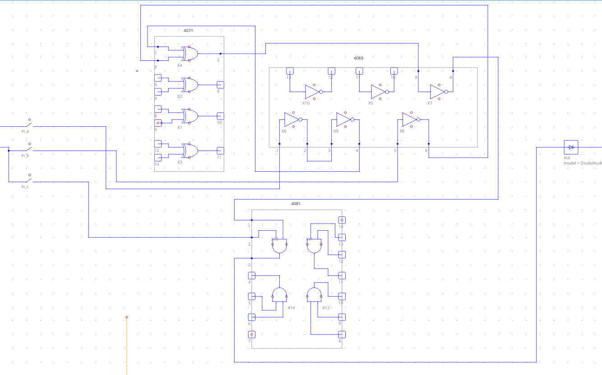

# An Electronic Circuit Simulator made in C++

## This is a school project made during my second year at EPITECH commonly known as "NanoTekSpice". 

</img>

**Note :** There is not graphical interface but I may implement one some day if I have the time...

****
## DESCRIPTION
****

This program is an electronic circuit simulator that build a graph of the connection between electronic component (such as chipsets, input, output, and some special components) from a configuration file and allow the user to change the state of the circuit input and run the simulation to see the result.

**Special Components :**

* input : a component with a single pin directly linked to the command line. Its value is initialized to `undefined`.

* clock : a component that works like an input, except its value is inverted after each simulation.

* true : a component with a single pin that is always true.

* false :  a component with a single pin that is always false.

* output : : a component with a single pin used as the output of a circuit.

**Chipsets Components :**

* 4001: Four NOR gates.
* 4011: Four NAND gates.
* 4030: Four XOR gates.
* 4071: Four OR gates.
* 4081: Four AND gates.
* 4069: Six INVERTER gates.
* 4008: 4 bits adder.
* 4013: Dual Flip Flop.
* 4017: 10 bits Johnson decade.
* 4040: 12 bits counter.
* 4094: 8 bits shift register.
* 4512: 8 channel data selector.
* 4514: 4 bits decoder.
* 4801: Random access memory.
* 2716: Read only memory

****
## COMPILATION
****

Generate the makefile :

`make -S .`

Compile the program :

`make`

Execute :

`./nanotekspice <".nts" file name>`

see [USAGE]() section for more details on `.nts file`.

****
## USAGE
****

This program take a `.nts` configuration file as first argument, this file is a representation of an electronic circuit.
The program then wait for entry in an infinite loop on the standard input, possible command are :

1. `exit` > close the program, sending an `EOF` also work.
2. `display` > display the current state of all **pins**, also display the **tick** (current number of execution).
3. `simulate` > simulate the flow of electricity in the circuit based on the current state of the **inputs**.
4. `loop` > make the program loop until `CTRL+C` is received, this is like running the `simulate` command many times.
5. `dump` > pretty print the states of every **pins** just like the `display` command.
6. `<input name>=0` set input to either `0` for false, `1` for true, or `U` for undefined.

**execution exemple :**

```
∼/user@fedora> ./nanotekspice or_gate.nts
> b=0
> a=1
> simulate
> display
tick: 1
input(s):
a: 1
b: 0
output(s):
s: 1
> exit

```

**configuration file :**

The `.nts` configuration files can be found under `docs/nts_single` or `docs/nts_advanced`, here is a very basic exemple : 

```
# Basic wire, direct link false to output.
#
# FALSE ---> OUTPUT

.chipsets:
false in
output out

.links:
in:1 out:1
```

Let's break it down :
- Comment start with `#` and are on a single line, all commented lines are ignored.

- `.chipsets:` declare the start of the **chipsets** section which include all basic electronic components such as **input** and **output** but also complex chipsets ranging from the **4081** (A chipset with 4 AND gates) to the **4801** (a basic ram stick).

- Everything following `.chipsets` until `.links` is part of the **chipsets** section of the configuration file.

- Inside the **chipsets** section, a chipset is declared as follow : `<chipset name> <given name>`.

- `.links` declare the start of the **links** section, define the links (or wire) between pins of the various chipsets.

- Inside the **links** section a link between 2 pin is declared as follow :
`<given chipset name>:<pin number> <second chipset name>:<pin number>`


